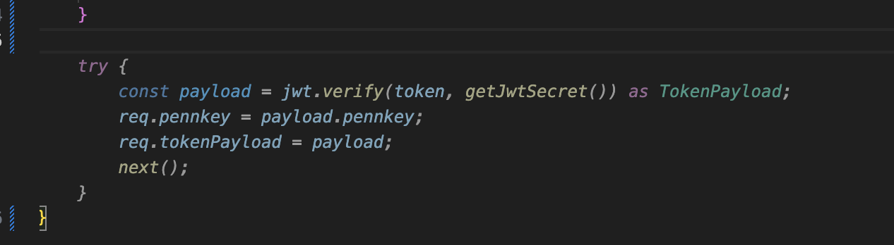

# Homework 5 AI Synthesis Activity

Only complete one of the assignments below! You can delete the other assignment in this document once you've made your choice.

## Activity: You used AI

### Part 1

> Cite the usage by including screenshots, a text transcript, or a link to the conversation with your AI of choice. Make sure to include any context, instructions, and all the conversations you had with the AI.
>
> I used AI tools (GitHub Copilot and ChatGPT) during the completion of this assignment.

#### GitHub Copilot Example

Below is a screenshot showing Copilot auto-generated code that I used as a starting point for part of my backend implementation: 

Copilot generated scaffolding for Express routes and TypeScript structures, which I modified to align with the homework specification and my own design choices.

#### ChatGPT Conversations

I also used ChatGPT at various stages of this assignment. Here are two representative examples:

Test suite generation + debugging assistance:
LINK_TO_CHATGPT_CONVO_1

Caching logic, failing PokeAPI call debugging, and architectural explanations:
LINK_TO_CHATGPT_CONVO_2

These conversations include context, debugging steps, explanations, and code that helped me work through difficult or time-consuming parts of the assignment.

### Part 2

> Write about why you used AI. Was there a gap in knowledge you wanted to fill? Were the answers through traditional search engines not adequate? Did you want to let AI help you format something in a quick manner?
>
> I used AI primarily as a tool to explain concepts, debug problems, and unstick myself when I wasn’t sure how different systems fit together. This homework involves many interacting components: Express.js, TypeScript, Redis persistence, JWT authentication, API data synthesis, and Bash scripting.

When I encountered unclear interactions—especially around Redis behavior, API call failures, caching strategies, or test automation—AI helped clarify the problem and guided me toward solutions more quickly than searching through documentation alone.

I also used ChatGPT to help generate a large, structured test suite for my Pokémon and Box endpoints. This prevented errors, ensured broad coverage, and let me focus my time on understanding and shaping the core backend rather than writing repetitive curl commands manually.

I still wrote and/or reviewed all final code myself; the AI simply acted as an assistant or tutor, not a replacement for my own work.

### Part 3

> Evaluate the AI's response. If you asked multiple questions, you can pick one of the responses the AI generated. Does the AI answer your question properly? Does it hallucinate any details? Could there be room to improve this response through manual editing? Did you accept this response fully or adapt parts of it into your work?
>
One AI response I relied on was the generation of the authentication error test script for the /box routes. I asked ChatGPT how to cover all the 401 UNAUTHORIZED scenarios described in the API specification, and it produced a Bash script that tested missing headers, incorrect schemes, empty Bearer tokens, invalid tokens, and even corrupted real tokens. The script was accurate, syntactically correct, and aligned perfectly with my backend’s expected behavior. I reviewed it to verify that no endpoints or assumptions were incorrect, and then integrated it with only minor adjustments. It worked on the first run, showing that the AI’s suggestion was both reliable and useful.

For the AI-generated autofilled code, this was a bit more iffy, and required more careful evaluation of its accuracy.

### Part 4

> If you used unfamiliar syntax or concepts generated by AI within your assignment, be sure to research them and explain what those concepts are to demonstrate your understanding.
>
> AI didn’t introduce completely new syntax to me, but it helped clarify and connect several concepts that I had seen before but never fully understood. For example, it explained Bash parameter expansions like ${VAR#pattern} and ${VAR%%pattern}, which I used to extract fields from JSON responses in my test scripts. It also helped reinforce how Redis key patterns work for user-scoped data, why JWT authentication requires the exact Authorization: Bearer tokenf ormat, and how to properly handle invalid or missing tokens. Additionally, AI helped me configure the ESLint flat config for TypeScript—specifically setting up @typescript-eslint/parser, adding the correct files block, and switching from browser globals to Node. These weren’t brand new ideas, but AI helped me understand them more clearly and apply them correctly in this project.
